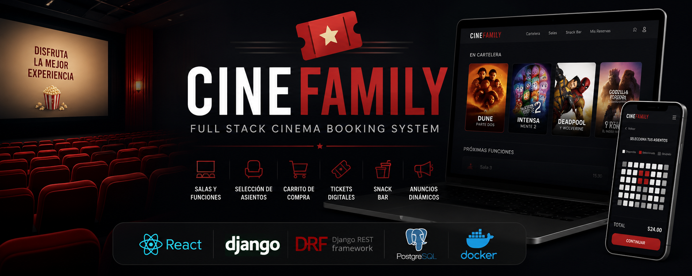
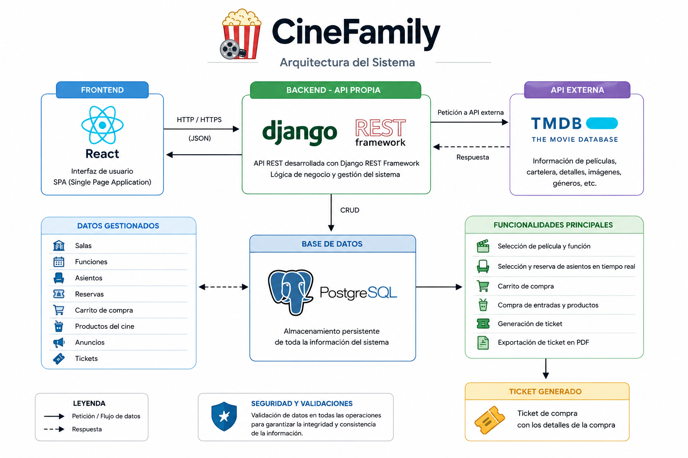
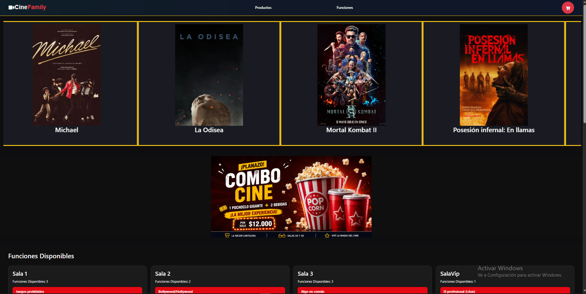
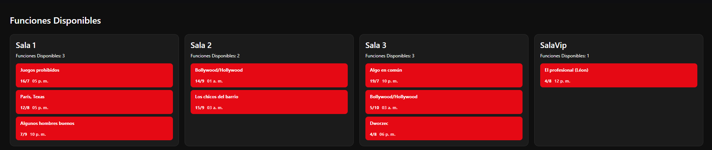
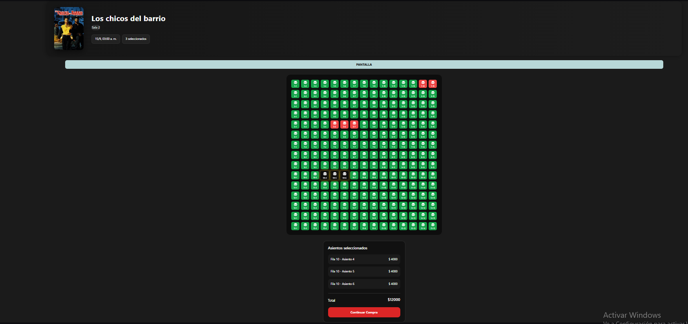
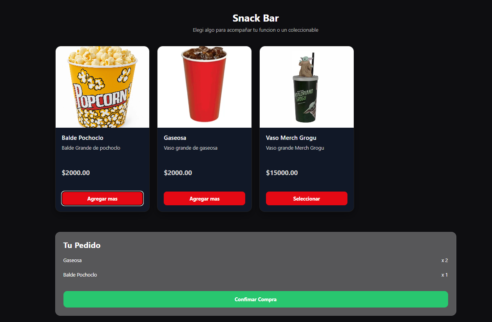
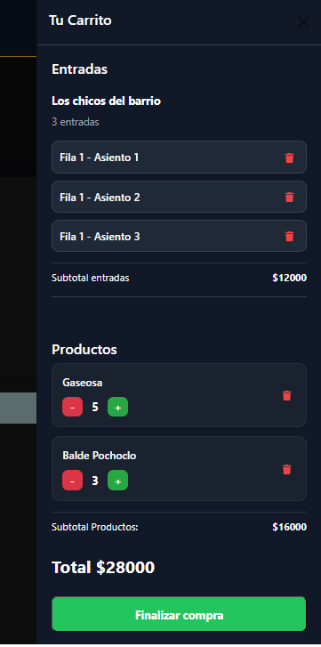
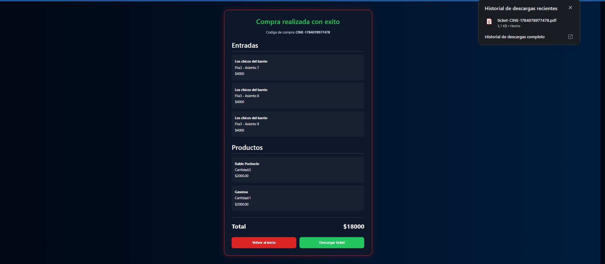

<p align="center"></p>

# 🎬 CineFamily
Aplicación Full Stack que recrea el flujo completo de compra de entradas para un cine, integrando una API propia desarrollada con Django REST Framework y la API pública de TMDB para la gestión de la cartelera.

>**Objetivo:** Diseñar e implementar la lógica completa de reservas, desde la selección de una función hasta la generación del ticket final.

## 🚀 Resumen
- 🎟️ Reserva de asientos en tiempo real
- 🛒 Carrito de compra y generacion de tickets
- 🎫 Exportacion de ticket en PDF
- 🎬 Integración con la API de TMDB
- 🐳 Despliegue mediante Docker
- 🗄️ PostgreSQL como base de datos


## 📖 Descripción
CineFamily es una aplicación Full Stack que simula el proceso de compra de entradas para un cine.

CineFamily fue desarrollado como proyecto de portfolio con el objetivo de aplicar conceptos de desarrollo Full Stack, diseño de APIs REST, integración de servicios externos, persistencia de datos y despliegue mediante contenedores Docker.

Más allá de la interfaz, el foco principal del proyecto fue diseñar e implementar la lógica completa del flujo de reservas, modelando entidades reales como salas, funciones, asientos, reservas, carrito de compra y generación de tickets.


## 🛠️ Tecnologías utilizadas 

| Categorías | Tecnología | Descripción |
|------------|------------|-------------|
|Frontend|<p align="center"><br><strong>React</strong></p>|Desarrollo de la interfaz de usuario basada en componentes.|
|Frontend|<p align="center"><br><strong>Vite</strong></p>|Herramienta de desarrollo y empaquetado del frontend.|
|Frontend|<p align="center"><br><strong>Axios</strong></p>|Cliente HTTP utilizado para consumir la API REST y la API de TMDB.|
|Backend|<p align="center"><br><strong>Django</strong></p>|Framework principal para el desarrollo del servidor.|
|Backend|<p align="center"><br><strong>Django REST Framework</strong></p>|Desarrollo de la API REST propia de la aplicación.|
|Base de Datos|<p align="center"><br><strong>PostgreSQL</strong></p>|Almacenamiento persistente de salas, funciones, reservas, productos, anuncios y tickets.|
|Infraestructura|<p align="center"><br><strong>Docker</strong></p>|Contenerización y despliegue del proyecto.|
|API exrerna|<p align="center"><strong>TMDB API</strong></p>| Obtención de la cartelera e información de las películas. |


## 🏗️ Arquitectura

CineFamily implementa una arquitectura cliente-servidor donde el frontend desarrollado con React consume una API REST propia desarrollada con Django REST Framework.

La API gestiona toda la lógica del sistema, incluyendo salas, funciones, asientos, reservas, productos del cine, anuncios dinámicos y generación de tickets. De forma complementaria, el backend consume la API pública de TMDB para obtener la información de las películas en cartelera, integrando ambas fuentes de datos en una única aplicación.

<p align="center"></p>


## ⭐Funcionalidades principales

### 🎥 Integración con TMDB
- Consulta de la cartelera mediante la API pública de TMDB.
- Asociación de funciones con películas utilizando el identificador de TMDB.
- Integración de la información de la función (horario, sala y asientos) con el título y la imagen de la película obtenidos desde TMDB.


### 🎬 Gestión de salas y funciones

- Creación y administración de salas desde el panel de administración de Django.
- Generación automática de asientos a partir de la cantidad de filas y columnas configuradas para cada sala.
- Programación de funciones asociando una película, una sala, una fecha y un horario específicos.

### 💺 Sistema de reservas

- Visualización del estado de cada asiento (Libre, Seleccionado y Reservado).
- Selección interactiva de uno o varios asientos para una misma función.
- Cálculo automático del subtotal antes de confirmar la compra.
- Validación de disponibilidad para evitar reservas sobre asientos ocupados.
### 🍿 Snack Bar

- Administración de productos desde la API desarrollada con Django REST Framework.
- Integración de productos con el mismo flujo de compra de las entradas.
### 📢 Sistema de anuncios

- Gestión de anuncios desde el panel de administración de Django.
- Configuración de su posición dentro de la aplicación (superior, intermedia o inferior).
- Visualización dinámica en el frontend sin modificar el código.

### 🛒 Carrito de compra

- Carrito unificado para entradas y productos del Snack Bar.
- Actualización automática del importe total de la compra.
- Resumen completo antes de finalizar la operación.

### 🎟️ Generación de tickets

- Generación automática del ticket al confirmar la compra.
- Exportación del ticket en formato PDF con el detalle completo de la operación.

## 📸 Recorrido por la aplicación

A continuación se muestran las principales pantallas de CineFamily, siguiendo el flujo de navegación del usuario desde la consulta de la cartelera hasta la selección de asientos para una función.

### 🎬 Cartelera de películas

<p align="center"></p>
La cartelera se obtiene mediante la API pública de TMDB, permitiendo mostrar información actualizada de las películas disponibles. Los anuncios publicitarios son administrados desde la API desarrollada con Django REST Framework, integrando contenido dinámico dentro de la misma interfaz.

### 🎟️ Funciones disponibles

<p align="center"></p>
Las funciones son administradas desde la API desarrollada con Django REST Framework. Cada función se encuentra asociada a una sala, una fecha y un horario determinados, permitiendo organizar la disponibilidad de las películas dentro del cine.

### 💺 Selección de asientos

<p align="center"></p>
Al seleccionar una función, la aplicación combina la información obtenida desde TMDB (título e imagen de la película) con los datos administrados por la API propia, mostrando la sala, la distribución de asientos y el estado de cada uno.
Los asientos son generados automáticamente al crear una sala y pueden encontrarse en estado libre, seleccionado o reservado. Durante la selección se calcula automáticamente el subtotal antes de incorporarlo al carrito de compra.

### 🍿 Snack Bar

<p></p>
El Snack Bar permite incorporar productos adicionales a la compra de entradas. Todos los productos son administrados desde la API desarrollada con Django REST Framework y se integran automáticamente en el carrito de compra.


### 🛒 Carrito de compra
<p></p>
El carrito unifica todos los elementos seleccionados durante la compra, incluyendo las entradas y los productos del Snack Bar. La aplicación calcula automáticamente el importe total y presenta un resumen completo antes de confirmar la operación.

### 🎟️ Ticket de compra

<p></p>
Una vez confirmada la compra, la aplicación genera un ticket con el detalle de la operación, incluyendo la función, los asientos reservados, los productos adquiridos y el importe total. El mismo contenido puede exportarse posteriormente en formato PDF.


## ⚙️ Instalación

### Requisitos
Antes de ejecutar el proyecto es necesario contar con:

- Docker
- Docker Compose
- Git

### Clonar el repositorio
``` bash
git clone https://github.com/CNBasualdo/CineFamily

cd CineFamily
```

### Ejecutar la aplicación

```bash
docker compose up -d
```
Una vez iniciados los contenedores, la aplicación estará disponible en:

Frontend
```text
http://localhost:5173
```

Backend (Django REST Framework)
```text
http://localhost:8000
```

Administrador de Django
```text
http://localhost:8000/admin
```

## 🔐 Variables de entorno

El proyecto utiliza un archivo `.env` para configurar la conexión con PostgreSQL.

```env
POSTGRES_DB=nombre_base_datos
POSTGRES_USER=usuario
POSTGRES_PASSWORD=tu_password
DATABASE_HOST=db
DATABASE_PORT=5432
```