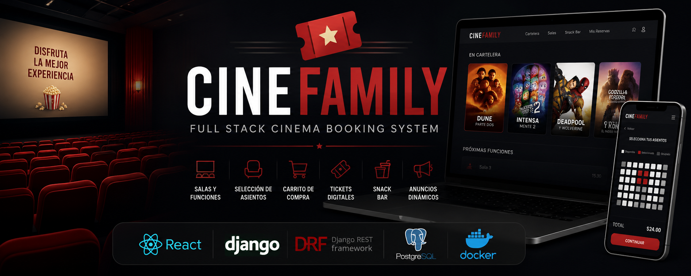
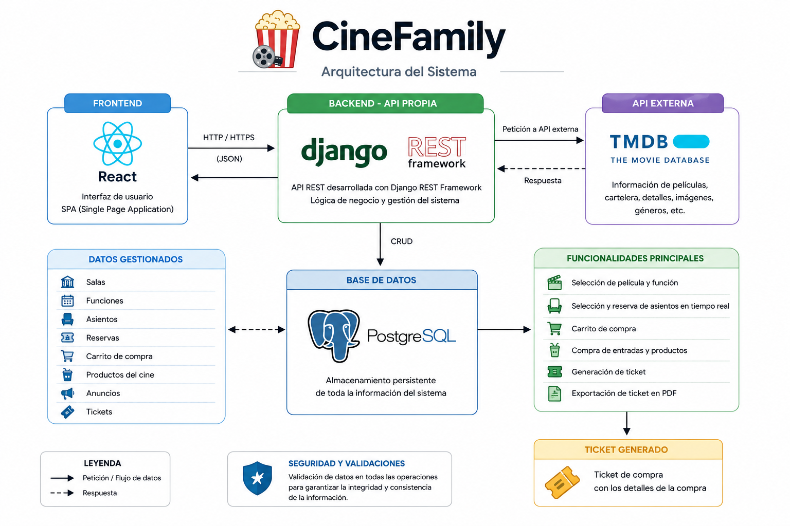
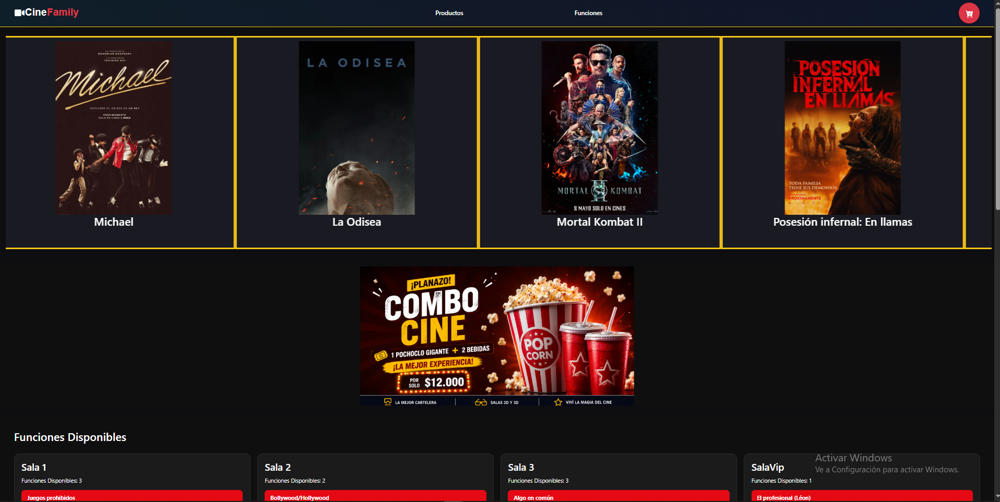
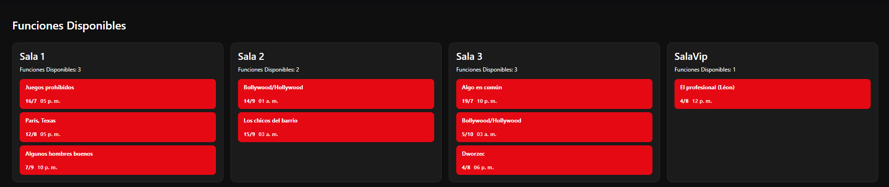
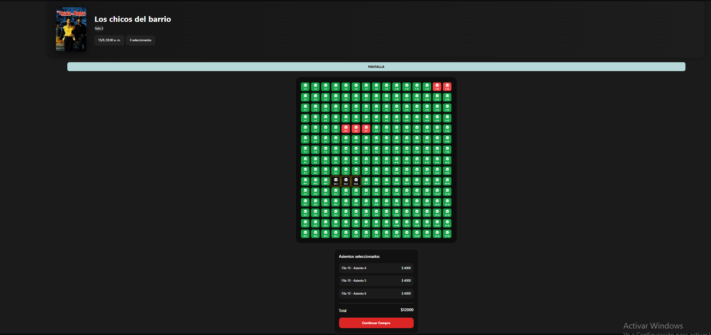
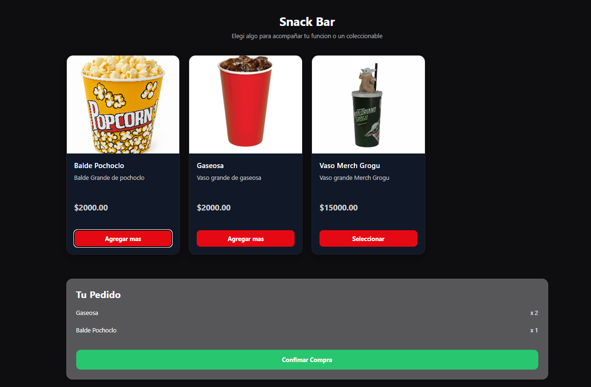
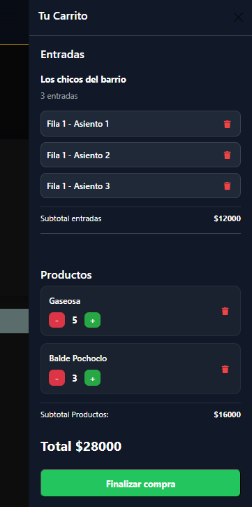
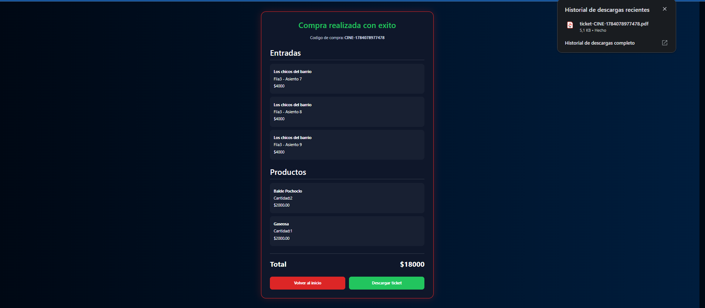

<p align="center"></p>

# 🎬 CineFamily

Aplicación Full Stack que recrea el flujo completo de compra de entradas para un cine, integrando una API propia desarrollada con Django REST Framework y la API pública de TMDB para la gestión de la cartelera.

> **Objetivo:** Diseñar e implementar la lógica completa de reservas, desde la selección de una función hasta la generación del ticket final.

## 🚀 Resumen

- 🎟️ Reserva de asientos en tiempo real
- 🛒 Carrito de compra y generacion de tickets
- 🎫 Exportacion de ticket en PDF
- 🎬 Integración con la API de TMDB
- 🐳 Despliegue mediante Docker
- 🗄️ PostgreSQL como base de datos

## 📖 Descripción

CineFamily es una aplicación Full Stack que simula el proceso de compra de entradas para un cine.

CineFamily fue desarrollado como proyecto de portfolio con el objetivo de aplicar conceptos de desarrollo Full Stack, diseño de APIs REST, integración de servicios externos, persistencia de datos y despliegue mediante contenedores Docker.

Más allá de la interfaz, el foco principal del proyecto fue diseñar e implementar la lógica completa del flujo de reservas, modelando entidades reales como salas, funciones, asientos, reservas, carrito de compra y generación de tickets.

## 🛠️ Tecnologías utilizadas

| Categorías      | Tecnología                                                                                                            | Descripción                                                                              |
| --------------- | --------------------------------------------------------------------------------------------------------------------- | ---------------------------------------------------------------------------------------- |
| Frontend        | <p align="center"><br><strong>React</strong></p>                       | Desarrollo de la interfaz de usuario basada en componentes.                              |
| Frontend        | <p align="center"><br><strong>Vite</strong></p>                      | Herramienta de desarrollo y empaquetado del frontend.                                    |
| Frontend        | <p align="center"><br><strong>Axios</strong></p>                       | Cliente HTTP utilizado para consumir la API REST y la API de TMDB.                       |
| Backend         | <p align="center"><br><strong>Django</strong></p>                     | Framework principal para el desarrollo del servidor.                                     |
| Backend         | <p align="center"><br><strong>Django REST Framework</strong></p> | Desarrollo de la API REST propia de la aplicación.                                       |
| Base de Datos   | <p align="center"><br><strong>PostgreSQL</strong></p>            | Almacenamiento persistente de salas, funciones, reservas, productos, anuncios y tickets. |
| Infraestructura | <p align="center"><br><strong>Docker</strong></p>                     | Contenerización y despliegue del proyecto.                                               |
| API externa     | <p align="center"><strong>TMDB API</strong></p>                                                                       | Obtención de la cartelera e información de las películas.                                |

## 🏗️ Arquitectura

CineFamily implementa una arquitectura cliente-servidor donde el frontend desarrollado con React consume una API REST propia desarrollada con Django REST Framework.

La API gestiona toda la lógica del sistema, incluyendo salas, funciones, asientos, reservas, productos del cine, anuncios dinámicos y generación de tickets. De forma complementaria, el backend consume la API pública de TMDB para obtener la información de las películas en cartelera, integrando ambas fuentes de datos en una única aplicación.

<p align="center"></p>

## ⭐Funcionalidades principales

### 🎥 Integración con TMDB

- Consulta de la cartelera mediante la API pública de TMDB.
- Asociación de funciones con películas utilizando el identificador de TMDB.
- Integración de la información de la función (horario, sala y asientos) con el título y la imagen de la película obtenidos desde TMDB.

### 🎬 Gestión de salas y funciones

- Creación y administración de salas desde el panel de administración de Django.
- Generación automática de asientos a partir de la cantidad de filas y columnas configuradas para cada sala.
- Programación de funciones asociando una película, una sala, una fecha y un horario específicos.

### 💺 Sistema de reservas

- Visualización del estado de cada asiento (Libre, Seleccionado y Reservado).
- Selección interactiva de uno o varios asientos para una misma función.
- Cálculo automático del subtotal antes de confirmar la compra.
- Validación de disponibilidad para evitar reservas sobre asientos ocupados.

### 🍿 Snack Bar

- Administración de productos desde la API desarrollada con Django REST Framework.
- Integración de productos con el mismo flujo de compra de las entradas.

### 📢 Sistema de anuncios

- Gestión de anuncios desde el panel de administración de Django.
- Configuración de su posición dentro de la aplicación (superior, intermedia o inferior).
- Visualización dinámica en el frontend sin modificar el código.

### 🛒 Carrito de compra

- Carrito unificado para entradas y productos del Snack Bar.
- Actualización automática del importe total de la compra.
- Resumen completo antes de finalizar la operación.

### 🎟️ Generación de tickets

- Generación automática del ticket al confirmar la compra.
- Exportación del ticket en formato PDF con el detalle completo de la operación.

## 📸 Recorrido por la aplicación

A continuación se muestran las principales pantallas de CineFamily, siguiendo el flujo de navegación del usuario desde la consulta de la cartelera hasta la selección de asientos para una función.

### 🎬 Cartelera de películas

<p align="center"></p>
La cartelera se obtiene mediante la API pública de TMDB, permitiendo mostrar información actualizada de las películas disponibles. Los anuncios publicitarios son administrados desde la API desarrollada con Django REST Framework, integrando contenido dinámico dentro de la misma interfaz.

### 🎟️ Funciones disponibles

<p align="center"></p>
Las funciones son administradas desde la API desarrollada con Django REST Framework. Cada función se encuentra asociada a una sala, una fecha y un horario determinados, permitiendo organizar la disponibilidad de las películas dentro del cine.

### 💺 Selección de asientos

<p align="center"></p>
Al seleccionar una función, la aplicación combina la información obtenida desde TMDB (título e imagen de la película) con los datos administrados por la API propia, mostrando la sala, la distribución de asientos y el estado de cada uno.
Los asientos son generados automáticamente al crear una sala y pueden encontrarse en estado libre, seleccionado o reservado. Durante la selección se calcula automáticamente el subtotal antes de incorporarlo al carrito de compra.

### 🍿 Snack Bar

<p></p>
El Snack Bar permite incorporar productos adicionales a la compra de entradas. Todos los productos son administrados desde la API desarrollada con Django REST Framework y se integran automáticamente en el carrito de compra.

### 🛒 Carrito de compra

<p></p>
El carrito unifica todos los elementos seleccionados durante la compra, incluyendo las entradas y los productos del Snack Bar. La aplicación calcula automáticamente el importe total y presenta un resumen completo antes de confirmar la operación.

### 🎟️ Ticket de compra

<p></p>
Una vez confirmada la compra, la aplicación genera un ticket con el detalle de la operación, incluyendo la función, los asientos reservados, los productos adquiridos y el importe total. El mismo contenido puede exportarse posteriormente en formato PDF.

## ⚙️ Instalación

### Requisitos

Antes de ejecutar el proyecto es necesario contar con:

- Git
- Docker
- Docker Compose
- Node.js y npm

### 1. Clonar el repositorio

```bash
git clone https://github.com/CNBasualdo/CineFamily.git
cd CineFamily
```

### 2. Configurar variables de entorno

Crear un archivo `.env` en la raíz del proyecto utilizando las variables indicadas en la sección **Variables de entorno**.

### 3. Iniciar los contenedores Docker

```bash
docker compose up -d
```

### 4. Aplicar las  migraciones

```bash
docker compose exec django_app python manage.py migrate
```


### 5. Instalar dependencias del frontend

```bash
cd client
npm install
```

### 6. Inciar el frontend
```bash
npm run dev
```
---

### 7. Acceder a la aplicacion

Una vez iniciado el proyecto, los servicios estaran disponibles en:
 
**Frontend (React)**
```text
http://localhost:5173
```
**Backend (Django REST Framework)**

```text
http://localhost:8000
```

**Panel de administración de Django**
```text
http://localhost:8000/admin
```

## 🔐 Variables de entorno
El proyecto utiliza un archivo `.env` para configurar la conexión entre Django y PostgreSQL.
Crear un archivo llamado `.env` en la raíz del proyecto con el siguiente contenido:

```env
POSTGRES_DB=nombre_base_datos
POSTGRES_USER=usuario
POSTGRES_PASSWORD=tu_password
DATABASE_HOST=db
DATABASE_PORT=5432
```

## 🗃️ Aplicar migraciones

Una vez iniciados los contenedores, es necesario crear la estructura de la base de datos ejecutando las migraciones de Django.

```bash
docker compose exec django_app python manage.py migrate
```

## 👤 Crear un superusuario

Para acceder al panel de administración de Django es necesario crear un usuario administrador.
```bash
docker compose exec django_app python manage.py createsuperuser
```
Luego de completar el usuario, contraseña y correo electrónico, podrá acceder al panel desde:

```text
http://localhost:8000/admin
```

## ⚙️ Configuración inicial

Una vez creado el superusuario, ingrese al panel de administración de Django y cargue la información inicial del sistema.
Se recomienda crear los siguientes elementos en este orden:

1. Salas
2. Funciones
3. Productos del Snack Bar
4. Anuncios

Al crear una sala se generan automáticamente sus asientos según la cantidad de filas y columnas configuradas.

##  📂 Estructura del proyecto
```text
CineFamily/
│
├── assets/                     # Recursos utilizados en el README
│   ├── icons/
│   ├── screenshots/
│   ├── BannerReadme.png
│   └── ArquitecturaDelProyecto.png
│
├── client/                     # Frontend desarrollado con React
│   ├── src/
│   ├── public/
│   ├── package.json
│   └── vite.config.js
│
├── config/                     # Configuración principal de Django
│
├── salas/                      # Aplicación principal del backend
│   ├── migrations/
│   ├── models.py
│   ├── serializers.py
│   ├── views.py
│   ├── urls.py
│   └── admin.py
│
├── data/
│   └── db/                     # Datos persistentes de PostgreSQL
│
├── docker-compose.yml
├── Dockerfile
├── requirements.txt
├── manage.py
├── .env.example
├── .gitignore
└── README.md
```
La aplicación se encuentra dividida en dos componentes principales:
- **client/**: contiene el frontend desarrollado con React, encargado de la interfaz de usuario y la interacción con las APIs.
- **salas/**: implementa la lógica del negocio mediante Django REST Framework, incluyendo la gestión de salas, funciones, reservas, productos, anuncios y tickets.
- **config/**: almacena la configuración global del proyecto Django.
- **data/db/**: directorio utilizado por Docker para persistir los datos de PostgreSQL durante el desarrollo.

## 🌐 API REST

La aplicación expone una API REST desarrollada con Django REST Framework que centraliza la lógica del negocio y permite la comunicación entre el frontend y el backend.

Los principales endpoints disponibles son:

| Endpoint | Función |
|----------|----------|
| `/api/funciones/` | Consulta de funciones disponibles. |
| `/api/funciones/{id}/asientos/` | Obtención de los asientos asociados a una función. |
| `/api/reservar/` | Registro de reservas de asientos. |
| `/api/comprar-productos/` | Compra de productos del Snack Bar. |
| `/api/productos/` | Administración de productos mediante ViewSet. |
| `/api/anuncios/` | Administración de anuncios mediante ViewSet. |

La API propia trabaja junto con la API pública de TMDB para integrar la información de las películas con la lógica interna del sistema.

## 🧩 Desafíos técnicos
Durante el desarrollo de CineFamily surgieron distintos desafíos relacionados con la lógica de negocio y la integración entre tecnologías.

### Gestión de reservas

El principal desafío fue diseñar un sistema que permitiera administrar la disponibilidad de los asientos de cada función, evitando inconsistencias entre reservas y reflejando correctamente el estado de cada asiento en el frontend.

### Integración de múltiples fuentes de datos

La aplicación combina información proveniente de dos APIs distintas:

- API propia desarrollada con Django REST Framework.
- API pública de TMDB.

Esto requirió unificar datos internos (funciones, salas y reservas) con información externa de las películas.

### Arquitectura del backend

Se implementó una API REST organizada mediante ViewSets, Serializers y modelos relacionados, manteniendo separada la lógica de negocio de la presentación de los datos.

### Contenerización

El proyecto fue preparado para ejecutarse mediante Docker y PostgreSQL, facilitando la reproducción del entorno de desarrollo en distintos equipos.

## 📚 Aprendizajes
El desarrollo de CineFamily permitió profundizar en distintos aspectos del desarrollo Full Stack, entre ellos:

- Diseño e implementación de APIs REST utilizando Django REST Framework.
- Modelado de entidades y relaciones en PostgreSQL.
- Integración de servicios externos mediante APIs públicas.
- Desarrollo de interfaces reutilizables con React.
- Gestión del estado de la aplicación y comunicación entre frontend y backend.
- Organización de un proyecto Full Stack siguiendo una arquitectura cliente-servidor.
- Contenerización del entorno de desarrollo utilizando Docker y Docker Compose.
- Documentación técnica y preparación de un proyecto para su publicación en GitHub.

## 🚀 Posibles mejoras
Algunas funcionalidades que podrían incorporarse en futuras versiones son:

- Implementar autenticación y gestión de usuarios.
- Incorporar pasarela de pagos para completar el proceso de compra.
- Agregar notificaciones por correo electrónico luego de la compra.
- Incorporar un panel de estadísticas para la administración del cine.
- Implementar pruebas automatizadas para el backend y el frontend.
- Desplegar la aplicación en un entorno de producción.

## 👤 Autor

**Carlos Nicolas Basualdo**

Desarrollador Full Stack en formación, enfocado en el desarrollo de aplicaciones web utilizando React, Django REST Framework, PostgreSQL y Docker.

- GitHub: https://github.com/CNBasualdo
- LinkedIn: https://www.linkedin.com/in/carlosnbasualdo233/